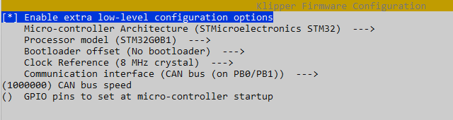

# Jak nainstalovat CAN desku EBB SB2209 od Bigteetrech

## 1. DFU mode

1. Ujisti se ze deska neni pripojena pres CAN rozhrani
2. Na CAN desce vloz jumper na pozici 5V
3. Propoj CAN desku a Raspberry USB kabelem
4. Nastav CAN desku do DFU modu (stisknout a drzet tlacitko BOOT pote stisknout a uvolnit tlacitko RESET a uvolnit tlacitko BOOT)

Overime desku ze je v rezimu DFU nasledujicim prikazem:
```
lsusb
```
Obdrzime obdobny vypis:
```
Bus 002 Device 001: ID 1d6b:0003 Linux Foundation 3.0 root hub
Bus 001 Device 006: ID 0483:df11 STMicroelectronics STM Device in DFU Mode
Bus 001 Device 005: ID 1d50:614e OpenMoko, Inc. stm32f446xx
Bus 001 Device 002: ID 2109:3431 VIA Labs, Inc. Hub
Bus 001 Device 001: ID 1d6b:0002 Linux Foundation 2.0 root hub
```
Zajima nas pouze polozka u ktere je uvedeno ze konkretni deska je v DFU mode, pokud na vypisu nevidime desku v DFU modu opakujeme krok 4 a prikaz pro novy vypis.

## 2. Klipper firmware

Přesuneme se do klipper složky a stáhneme poslední aktualizaci z gitu:
```
cd ~/klipper && git pull
```
Odstraníme předešlé kompilace:
```
make clean
```
Provedeme nastavení HW pro který to kompilujeme:
```
make menuconfig
```

Nastavíme takto:



Nezapomeňte dopsat: rychlost `500000` (nebo až `1000000`, musí byt stejná jak jsme dali v nastaveni rychlosti can sbernice pro can0 rozhrani)

Zmackneme `q` pro ulozeni a `y` pro potvrzeni.

Zkompilujeme firmware:
```
make -j4
```
Overime ze je zarizeni stale v DFU modu prikazem:
```
lsusb
```
Musime videt obdobny vysledek ID se muze lisit:
```
Bus 001 Device 006: ID 0483:df11 STMicroelectronics STM Device in DFU Mode
```

Muzeme nahrat Klipper firmware:
```
make flash FLASH_DEVICE=0483:df11
```
Vypneme tiskarnu, odpojime USB kabel od CAN desky a RPI, pripojime sbernici CAN.
POZOR! dukladne zkontrujte spravnost zapojeni CAN vodicu L/H a spravnou polaritu 24V, jinak hrozi nevratne poskozeni desky.
Zapneme tiskarnu.

###  Vytvoření Canbus interface:

Doinstalujeme balíčky, které budeme potřebovat:
```
sudo apt update && sudo apt install nano wget -y
```

Vytvorime CAN rozhrani. Otevreme soubor `/etc/network/interfaces.d/can0` pomocí textového editoru `nano`. Musíme použiť `sudo`, protože sa jedná o systémový soubor:
```
sudo nano /etc/network/interfaces.d/can0
```
A vložíme nasledovny text, **zde si nastavte rychlost jakou jste zvolili pri kompilaci firmwaru, v mem pripade 1000000**. :
```
allow-hotplug can0
iface can0 can static
    bitrate 1000000
    up ifconfig $IFACE txqueuelen 1024
    pre-up ip link set can0 type can bitrate 1000000
    pre-up ip link set can0 txqueuelen 1024
```

Uložíme sstisknutím `Ctrl + O` (uložit soubor), `Enter` na potvrzení názvu souboru a `Ctrl + X` na zavrení editoru (dole v editoru tyto zkratky můžete vidět).

Restartujeme RPI:
```
sudo reboot
```

### Zjištění canbus uuid

Presuneme se do klipper slozky:
```
cd ~/klipper
```

Zjistime prikazem:
```
python3 lib/canboot/flash_can.py -q
```

Dostaneme odpoved:
```
pi@Voron:~/klipper $ python3 lib/canboot/flash_can.py -q
Resetting all bootloader node IDs...
Checking for canboot nodes...
Detected UUID: aabc3898e436, Application: Klipper
Query Complete
```

Zjistene me CanBus UUID je: `aabc3898e436` vaše bude jine, to sve si zkopirujte !!!!
Nasledne ho vlozite do souboru printer.cfg

[mcu EBBCan]
canbus_uuid: aabc3898e436

