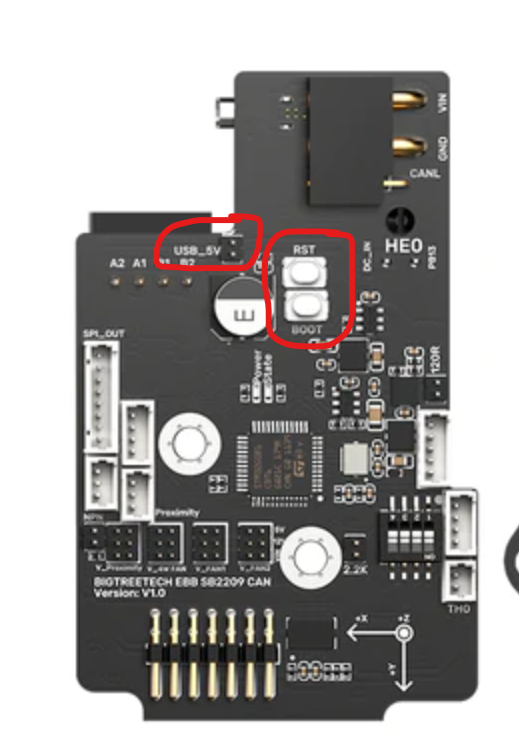

# 🚌 Jak nainstalovat CAN desku EBB SB2209 od Bigteetrech

## <mark style="color:orange;">1. DFU mode</mark>

1. Ujisti se ze deska není připojena přes CAN rozhraní
2. Na CAN desce vlož propojku (jumper) na pozici 5V
3. Propoj CAN desku a Raspberry USB kabelem
4. Nastav CAN desku do DFU modu (stisknout a držet tlačítko BOOT poté stisknout a uvolnit tlačítko RESET následně uvolnit tlačítko BOOT)

<figure><figcaption></figcaption></figure>

Ověříme desku že je v režimu DFU následujícím příkazem:

```
lsusb
```

Obdržíme podobný výpis:

```
Bus 002 Device 001: ID 1d6b:0003 Linux Foundation 3.0 root hub
Bus 001 Device 006: ID 0483:df11 STMicroelectronics STM Device in DFU Mode
Bus 001 Device 005: ID 1d50:614e OpenMoko, Inc. stm32f446xx
Bus 001 Device 002: ID 2109:3431 VIA Labs, Inc. Hub
Bus 001 Device 001: ID 1d6b:0002 Linux Foundation 2.0 root hub
```

Zajímá nás pouze položka, u které je uvedeno ze konkrétní deska je v DFU mode, pokud na výpisu nevidíme desku v DFU modu opakujeme krok 4 a příkaz pro nový výpis.

## <mark style="color:orange;">2. Klipper firmware</mark>

Přesuneme se do klipper složky a stáhneme poslední aktualizaci z gitu:

```
cd ~/klipper && git pull
```

Odstraníme předešlé kompilace:

```
make clean
```

Provedeme nastavení HW pro který firmware kompilujeme:

```
make menuconfig
```

Nastavíme takto:


Nezapomeňte dopsat rychlost <mark style="color:red;">`500000`</mark> (nebo až <mark style="color:red;">`1000000`</mark>, musí byt stejná jak jsme uvedli v nastaveni rychlosti CAN sběrnice pro can0 rozhraní)

Zmáčkneme <mark style="color:red;">`q`</mark> pro uložení a <mark style="color:red;">`y`</mark> pro potvrzení.

Zkompilujeme firmware:

```
make -j4
```

Ověříme že je zařízení stále v DFU modu příkazem:

```
lsusb
```

Musíme vidět podobný výsledek ID se může lišit:

```
Bus 001 Device 006: ID 0483:df11 STMicroelectronics STM Device in DFU Mode
```

Můžeme nahrát vytvořený Klipper firmware:

```
make flash FLASH_DEVICE=0483:df11
```

Vypneme tiskárnu, odpojíme USB kabel od CAN desky a RPI, připojíme sběrnici CAN a nezapomeneme vložit propojku pro zakončení sběrnice na pozici <mark style="color:red;">**120R**</mark>.\
POZOR! důkladně zkontrolujte správnost zapojení CAN vodičů L/H a správnou polaritu 24V, jinak hrozí nevratné poškození desky. Zapneme tiskárnu.

## <mark style="color:orange;">3. Vytvoření Canbus interface:</mark>

Doinstalujeme balíčky, které budeme potřebovat:

```
sudo apt update && sudo apt install nano wget -y
```

Vytvoříme CAN rozhraní. Otevřeme soubor <mark style="color:red;">`/etc/network/interfaces.d/can0`</mark> pomocí textového editoru `nano`. Musíme použít <mark style="color:red;">`sudo`</mark>, protože se jedná o systémový soubor:

```
sudo nano /etc/network/interfaces.d/can0
```

A vložíme následující text, zde si nastavte rychlost jakou jste zvolili při kompilaci firmwaru, v mém případě 1000000. :

```
allow-hotplug can0
iface can0 can static
    bitrate 1000000
    up ifconfig $IFACE txqueuelen 1024
    pre-up ip link set can0 type can bitrate 1000000
    pre-up ip link set can0 txqueuelen 1024
```

Uložíme stisknutím kláves <mark style="color:red;">`Ctrl + O`</mark> (uložit soubor), <mark style="color:red;">`Enter`</mark> na potvrzení názvu souboru a <mark style="color:red;">`Ctrl + X`</mark> na zavření editoru (dole v editoru tyto zkratky můžete vidět).

Restartujeme RPI příkazem:

```
sudo reboot
```

### Zjištění canbus UUID

Přesuneme se do klipper složky:

```
cd ~/klipper
```

Zjistíme UUID příkazem:

```
python3 lib/canboot/flash_can.py -q
```

Dostaneme podobnou odpověď:

```
pi@Voron:~/klipper $ python3 lib/canboot/flash_can.py -q
Resetting all bootloader node IDs...
Checking for canboot nodes...
Detected UUID: aabc3898e436, Application: Klipper
Query Complete
```

Zjištěné moje CanBus UUID je: <mark style="color:red;">`aabc3898e436`</mark> vaše bude jiné, to své si zkopírujte !!!!\
Následně ho vložíte do souboru <mark style="color:red;">`printer.cfg`</mark>

`[mcu EBBCan]`\
`canbus_uuid: aabc3898e436`
